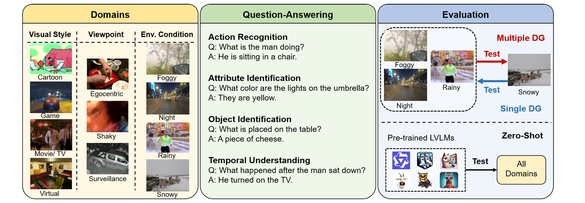

# 🎥 VUDG: A Dataset for Video Understanding Domain Generalization

<div align="center">
  
</div>

<div align="center">

  <a href="https://arxiv.org/abs/2505.24346" target="_blank">
    
  </a>
  <a href="https://huggingface.co/datasets/QLGalaxy/VUDG" target="_blank">
    
  </a>
  <a href="https://creativecommons.org/licenses/by-nc-sa/4.0/">
    
  </a>

</div>

<br>


## 📖 Introduction

**VUDG** is a comprehensive benchmark dataset designed to evaluate **Domain Generalization (DG)** capabilities in video understanding models. To rigorously test robustness, VUDG maintains semantic consistency across domains, ensuring that performance drops are attributable to domain shifts rather than semantic variability.

### Key Features
- **⚖️ Semantic Consistency:** The dataset maintains semantic consistency across domains to ensure that model performance reflects domain generalization ability rather than semantic variability.
- **📊 Large-Scale:** Contains **7,899** video clips and **36,388** high-quality QA pairs.
- **🌍 Diverse Domains:** Covers **11 distinct visual domains**, including *Cartoon, Egocentric, Surveillance, Rainy, Snowy*, and more.
- **📝 Rich Annotations:** Includes both **Multiple-Choice** and **Open-Ended** QA pairs.
- **🤖 High Quality:** Constructed via a **multi-expert progressive annotation pipeline** involving Large Multimodal Models (LMMs) and human verification.

---

## ⚙️ Installation

### 1. Clone Repository
```bash
git clone https://github.com/VUDG-Video/VUDG.git
cd VUDG
```

### 2. Build Environment
We recommend using Conda to manage the environment.
```bash
conda create -n vudg python=3.12
conda activate vudg
pip install -r requirements.txt
```

---

## 📂 Data Preparation

1. Download the VUDG dataset from [Hugging Face](https://huggingface.co/datasets/QLGalaxy/VUDG).
2. Organize the data as follows to match the project structure:

```text
VUDG/
├── data/
│   ├── trainset/    # Place training videos here
│   └── testset/     # Place testing videos here
├── zeroshot/
├── utils/
└── ...
```

---

## 🚀 Evaluation

### Zero-Shot Evaluation
We provide scripts for zero-shot evaluation on various LMMs. Below is an example using **Qwen2.5-VL-7B**:

**1. Run Inference**
```bash
python ./zeroshot/qwen2.5vl.py
```

**2. Collect and Calculate Metrics**
```bash
python ./utils/collect_results.py
```

---

## 🖊️ Citation

If you find VUDG useful for your research, please consider citing our paper:

```bibtex
@misc{wang2025vudgdatasetvideounderstanding,
      title={VUDG: A Dataset for Video Understanding Domain Generalization}, 
      author={Ziyi Wang and Zhi Gao and Boxuan Yu and Zirui Dai and Yuxiang Song and Qingyuan Lu and Jin Chen and Xinxiao Wu},
      year={2025},
      eprint={2505.24346},
      archivePrefix={arXiv},
      primaryClass={cs.CV},
      url={https://arxiv.org/abs/2505.24346}, 
}
```

## 📄 License
This project is licensed under the CC BY-NC-SA 4.0 license.